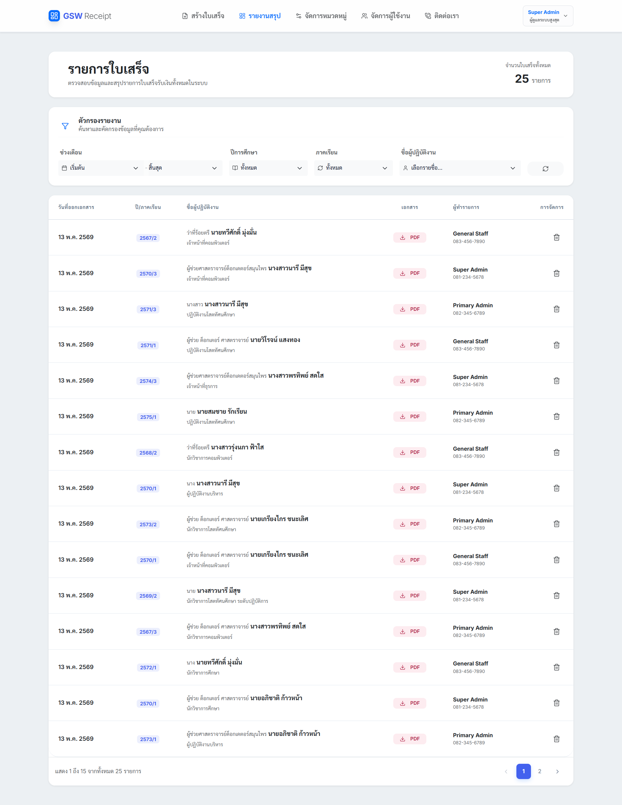
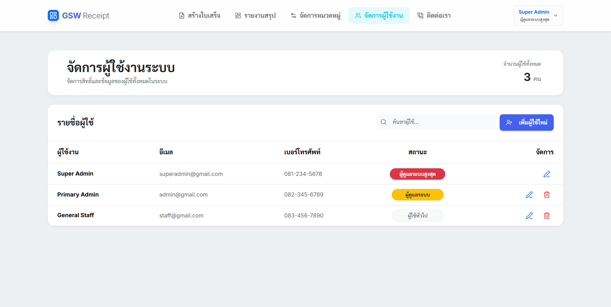
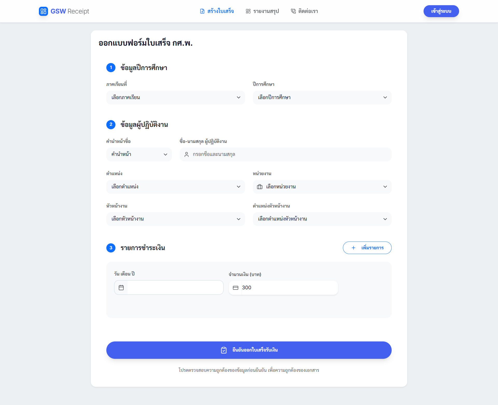

# GSW Receipt System (ระบบออกใบเสร็จ กศ.พ.)

> ระบบบริหารจัดการและออกใบเสร็จรับเงิน — บันทึกข้อมูลรวดเร็วผ่าน Public Form, ออกเอกสาร PDF อัตโนมัติ, เก็บประวัติไฟล์ PDF สามารถดูย้อนหลังได้, มีระบบจัดการผู้ใช้และหมวดหมู่, มีระบบจัดการรายงานสรุป

## -------------------------------------------------------------------

🔗 **[Live Demo](https://the-vocational-education-receipt-sy-delta.vercel.app)**

## -------------------------------------------------------------------

### Demo Credentials

| Role | Email | Password |
|---|---|---|
| **Super Admin** | `superadmin@gmail.com` | `123456789` |
| **Administrator** | `admin@gmail.com` | `123456789` |
| **Staff** | `staff@gmail.com` | `123456789` |
| **General User** | `(No Login Required)` | `Public Access` |

> [!IMPORTANT]
> ระบบมีการจัดลำดับสิทธิ์ผู้ใช้งาน 4 ระดับ: **Super Admin** (สิทธิ์สูงสุด), **Administrator** (ผู้จัดการ Staff), **Staff User** (คนทำงานหลัก), และ **Guest** (ผู้ใช้สาธารณะ) เพื่อความปลอดภัยและถูกต้องของข้อมูล

---

## Screenshots & Demos

### Smart PDF Generation (GIFs)
| **Authenticated Workflow (Staff/Admin)** | **Privacy-First Public Engine (Guest)** |
|---|---|
|  |  |
| *บันทึกข้อมูลลงฐานข้อมูล พร้อมออกเอกสารทันที* | *ออกใบเสร็จดิจิทัลแบบไม่เก็บข้อมูล มุ่งเน้นความเป็นส่วนตัว* |

---

### System Interface
#### Real-time Summary Dashboard
ระบบวิเคราะห์และสรุปผลการออกใบเสร็จที่มาพร้อม Filter อัจฉริยะ ช่วยให้การค้นหาข้อมูลย้อนหลังเป็นเรื่องง่ายและแม่นยำ

#### Hierarchical User Management (RBAC)
การจัดการสิทธิ์เข้าถึงตามลำดับชั้นที่เข้มงวด (Super Admin, Admin, Staff) ผ่าน UI ที่ใช้งานง่ายและ Badge สถานะที่ชัดเจน

#### Fast-Issuance Public Form
นวัตกรรมการออกเอกสารที่รวดเร็วผ่านแบบฟอร์มสาธารณะ ไม่ต้องล็อกอินก็สามารถเจนเอกสาร PDF คุณภาพสูงได้ทันที

#### Professional PDF Output
ตัวอย่างเอกสารที่ผลิตจากระบบ รองรับการจัดรูปแบบตัวเลขทศนิยมและเครื่องหมายคั่นหลักพันตามมาตรฐานบัญชี
🔗 **[ดูตัวอย่างไฟล์ PDF ตัวจริง](docs/screenshots/PDF_Results.pdf)**

---

## Key Features

| Feature | รายละเอียด |
|---|---|
| **Hierarchical RBAC** | ควบคุมสิทธิ์การเข้าถึงข้อมูลตามบทบาทของผู้ใช้งาน 4 ระดับอย่างเข้มงวด |
| **Guest PDF Engine** | ออกใบเสร็จ PDF ได้ทันทีโดยไม่เก็บข้อมูลลงระบบ มุ่งเน้นความเป็นส่วนตัว (Privacy First) |
| **Digital PDF Engine** | เจนไฟล์ใบเสร็จ PDF คุณภาพสูง พร้อมดาวน์โหลดหรือเรียกดูย้อนหลังได้ทันที |
| **Advanced Management** | จัดการข้อมูลผู้ใช้และหมวดหมู่ผ่าน Modals ที่ทันสมัย รองรับการคลิก Backdrop เพื่อปิด |
| **Report Summary** | ระบบค้นหาและสรุปรายการใบเสร็จย้อนหลังที่แม่นยำและรวดเร็ว |
| **Responsive Design** | รองรับการทำงานทุกอุปกรณ์อย่างไร้รอยต่อ (Mobile, Tablet, Desktop) |

---

## Tech Stack & Rationale

| Technology | Version | เหตุผลที่เลือก |
|---|---|---|
| **React** | 19.2 | พัฒนา UI ที่ลื่นไหลและจัดการ State ของใบเสร็จที่ซับซ้อนได้อย่างดีเยี่ยม |
| **Node.js / Express** | 4.18 | จัดการ API Endpoints และระบบ Authentication ที่ขยายตัวง่าย |
| **PostgreSQL (Neon)** | 16 | ฐานข้อมูลแบบ Serverless บน Cloud ที่ขยายตัวได้ง่ายและเสถียรสูง |
| **Vercel** | Cloud | Deployment Platform สำหรับทั้ง Frontend และ Backend แบบ Serverless |
| **Bootstrap** | 5.3 | เฟรมเวิร์กที่ช่วยสร้าง Layout ที่เป็นระเบียบและ Responsive |

---

## User Roles & Permissions

| สิทธิ์การใช้งาน | Super Admin | Administrator | Staff (Login) | Guest (Public) |
|---|:---:|:---:|:---:|:---:|
| เข้าถึงหน้าฟอร์มสาธารณะ | ✅ | ✅ | ✅ | ✅ |
| เจน PDF ใบเสร็จทันที | ✅ | ✅ | ✅ | ✅ |
| บันทึกข้อมูลลงฐานข้อมูล | ✅ | ✅ | ✅ | ❌ |
| ดูรายงานสรุป | ✅ | ✅ | ✅ | ❌ |
| เพิ่ม/แก้ไข หมวดหมู่ | ✅ | ✅ | ✅ | ❌ |
| ลบ หมวดหมู่ | ✅ | ✅ | ❌ | ❌ |
| เพิ่ม/แก้ไข/ลบ ผู้ใช้ Staff | ✅ | ✅ | ❌ | ❌ |
| ลบ ผู้ใช้ (admin, staff) | ✅ | ❌ | ❌ | ❌ |

---

## About the Developer

**คุณสุรสิทธิ์ พิมพ์สีดา (Surasit Phimseeda)**

- [surasit.phimseeda111@gmail.com](mailto:surasit.phimseeda111@gmail.com)
- [github.com/Surasit111](https://github.com/Surasit111)

---

## License

This project is proprietary software. All rights reserved.

---

*Developed with ❤️ for excellence in GSW Financial Management.*